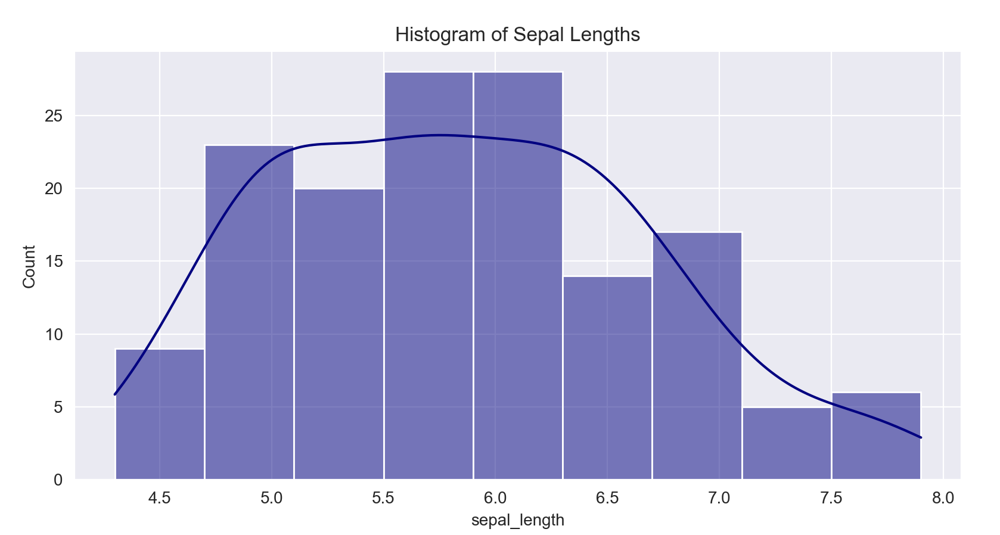
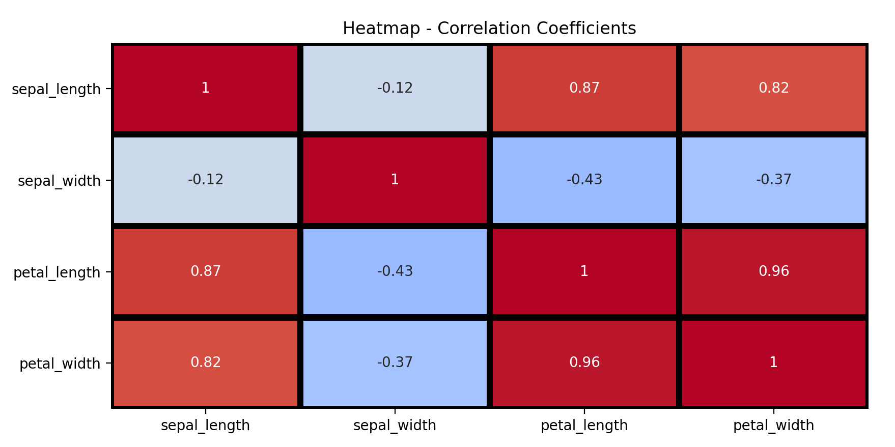

# Programming and Scripting 2021 Project: Fisher's Iris Data Set
## Lecturer: Andrew Beatty
## Author: Ross Downey

## PURPOSE
The purpose of this project is to research the well known Fisher's Iris Data set online, 
and to write documentation and Python code which investigates the data set appropriately.

## RESEARCH
To initiate this project, the author began by searching the internet for resources and previous
investigations into this data set. Having never previously heard of the Iris dataset the author began research using Google and also read the initial scientific journal wriiten by 
Ronald Fisher regarding this data. There are a wide variety of resources and studies based on this
data set (a reference section is included below of the ones used for the purposes of this project).

## BACKGROUND
In 1936 the British biologist and statistician Ronald Fisher published a paper titled 
'The use of multiple measurements in taxonomic problems as an example of linear discriminant analysis'
in the scientific journal 'The Annals of Human Genetics'. In this paper Fisher developed a linear function to differentiate three different types of iris flower species (setosa, versicolor and virginica)
based on the lengths and widths of the flower's petals and sepals. Fisher evaluated this linear function based on data collected by the famed botanist Dr. Edgar Anderson. Anderson measured the lengths and widths of sepals and petals of fifty of each of the three types of iris. This yielded one hundred and fifty samples of data to work with and to help build Fisher's linear function. 
From these measurements Fisher was able to propose a model that could predict the species of a given iris based on the measurement of its sepals and petals.

## SCOPE
The scope of this project is to download the Fisher / Anderson iris data set into Python, write a program in Python that outputs a summary of each variable to a single text file, saves a histogram of each variable to png files and outputs a scatter plot of each pair of variables. A text file summarising the project will also be created to clearly explain what is entailed in investigating the data set and how Python is adept at handling this data.

## CODE
Note the programs on this project were all created using Python software on Microsoft Visual Studio Code. There are no specific requirements for running this code, download the relevant softwares (in this case Anaconda ver 3, and Microsoft VS Code) from internet and run accordingly. Each section below outlines what the code does, and summaries of the program outputs have been added to this readme file to make the project user friendly.

## INITIAL ASSESSMENT
To begin assessing this data the author decided that the best place to start would be to mean all of the dimensions given in the data. To a student not familiar with data analytics it is not clear what way a project such as this should be initiated, it is felt that the average values would be a good place to start!

Following this the author noted that the overall means, although useful, would not demonstrate the differences in petal/sepal dimensions. Consequently, the next step was to group the data by species (setosa / versicolor / virginica) and then determine the average sizes per group. A quick assessment of these means clearly shows that the virginica has the longest (average) sepal lengths, but the setosa has the widest (average) sepal widths. The versicolor has the longest petal lengths, but the virginica has the widest petals. 

This is an encouraging start to the assessment of this data. It is clearly evident, just from assessing the mean dimensions 
(and maxima / minima), that the three different species can, in some way, be distinguished from each other.
Further statistical evaluation is required, particularly in the area of standard deviations, quartile ranges etc., along with graphical representations (histograms, scatter plots etc.) to present and correlate the data.
Further statistical assessment of the Iris dataset was performed. This involved more research into capabilities of Python for handling datasets and outputting valuable information such as standard deviation, quartiles, minima / maxima etc. The author also discovered Python's ability to group the data by species and assess the data statistically in a grouped manner using the "pivot" function in the seaborn module.
Also, the "info" function was researched. This confirmed that the data did not require cleaning (no null values found), and that 150 values were present in the dataset, which was the required number. 

While this data has shown to be useful in terms of differentiating statistical values in terms of species, it has quickly become apparent that it is difficult to read and comprehend these numbers as the amount of data generated has become quite significant in a short space of time. Consequently, the next step in the analysis of this dataset is graphical representation. As the initial program has now become quite large it was decided to start graphical plots on a new program.
A program has been created (dataOutput.py) which outputs a summary of the dataset to a text file (variableSummary.txt). This gives a good overview of the dataset. 

## GRAPHICAL REPRESENTATIONS - BOXPLOTS
Boxplots of the Iris dataset were used in order to provide a clearer visual overview of the dimensions of the three different iris species. Boxplots are a graphical representation of range of data which show the mean, minimum, maximum, quartiles (and interquartile range).
The first box plot performed was of a plot of the different lengths and widths of petals and sepals of all 150 irises ungrouped.

Inital observations from this are:
* a) The sepals lengths are the largest numbers, the petals widths are the smallest.
* b) The width of the petals gives the largest range, while the sepal widths give the smallest

This is also a good indicator that the variables measured give significant differences which could be exploited for the purposes of building a predictive model.

Further boxplots were also created but this time the data was grouped by species.
These boxplots give a better indication of sizes of petals / sepals in each species, which in turn could give a better idea of the defining characteristics of each type of iris. Greater knowledge of the defining dimensions of these iris species will help in building a model for predicting a species from its sepal and petal sizes. 

The following observations were made from these boxplots:

* 1) Virginica has longer sepals than setosa, but are closer in length to versicolor.
* 2) Setosa has wider sepals than both versicolor and virginia (which are similar in sepal width).
* 3) Virginica has significantly longer petals than setosa, but are similar to versicolor.
* 4) Virginica also has significantly wider petals than setosa, and are slightly wider than versicolor.
* 5) Setosa has the narrowest range of all four dimensions which may make it easier to identify, particularly in petal length and width.

## GRAPHICAL REPRESENTATION - HISTOGRAMS
Following the construction of boxplots and the data trends revealed by these, the next step was to construct histograms using the data for further analysis. A histogram arranges the data in groups (or bins / buckets) and then gives the frequency of this data in its respective groups. It is constructed with the groups on the x-axis and the frequency (represented by heights of bars) on the y-axis. Histograms can clearly indicate the spread of data and are give a good indication if the data is normally distributed or skewed. Matplotlib and Seaborn are two useful functions in Python for plotting histograms.
Initially, the histograms were constructed on the basis of their dimensions only. While useful in terms if visualisation of the dataset as a whole, this did not provide any assistance in building a predictive model.

The key take from these histograms is that both the sepal lengths and widths appear to be relatively normally distributed (the sepal widths appear particularly normally distributed). The petal dimensions, however, do not show any semblance of a normal distribution, and are both in fact bimodal. This infers that a predicitive model is more likely to be constructed through use of the sepal dimensions instead of the petal measurements. If data is normally distributed about the mean it implies that it is in stastical control and it is more favourable to predicitive models. The presence of skewed or bimodal histograms is more indicative of data that is not in statistical control.
Another possibility for the presence of two modes in the petal dimension histograms is that there are outliers in the data. Although the highest mode in the lower ranges it is not beyond the realm of possibility that these values are atypical for petal dimensions (or possibly that some species that were measured were not fully grown?). Using a relatively small dataset (150 in this case) can lead to the presence of outliers. Statistical analysis could be performed on the dataset to determine the possible presence of outliers (for example z-score analysis), but as the dataset is very well established (and won't be changing anytime soon!) the best approach is to include all dimension measurements.
The likely source of these two modes is the difference in petal dimensions between the species. From the boxplots previously plotted it was evident that the setosa species is noticeably smaller than the versicolor and virginica in terms of petal dimensions. This should be confirmed by grouping the data by species and subsequently plotting histograms.

On researching the internet for further histogram plots the author noted the "pairplot" function. This allowed plots to be constructed in appropriate groups (in this case species of iris). The resulting histogram and scatter plots gave a decent overview of the data which allowed for further assessment of the dataset. 

Observations from this pairplot incude:
* 1) Petal Length vs Petal Width seems to indicate a high level of regression for all species.
* 2) Sepal Length vs Sepal Width indicates the opposite.
* 3) Sepal Length vs Petal Length indicates good regression for versicolor and virginica, but not for setosa.
* 4) Sepal Length vs Petal Width also indicates a level of regression for versicolor and virginica but not for setosa.
* 5) Overall this pairplot indicates that the setosa species may not be suitable to build a predicitive model in this way but some dimensions of virginica and versicolor could be used. This should be support and/or confirmed by creating these scatter plots for each pair of data and calculating the regression value of each plot.

GRAPHICAL REPRESENTATION - HISTOGRAMS (GROUPED BY SPECIES)
The iris dataset was divided into species and each dimension was plotted on a histogram. 
This helps us to visualise the data in a better manner than the pairplot.

Observations made include:
* 1) Petal Length: Tends to be normally distributed with a noticeable difference between setosa and the other two species
* 2) Petal Width: Not as normally distributed but setosa also obviously different (shorter) than versica and versicolor
* 3) Sepal Length: All three species appear normally distributed but are close together (with some overlap)
* 4) Sepal Width: Also are tending towards normal distribution but are very close together. In the case of versicolor and virginia the dimensions are nearly indistinguishable from each other.

These grouped histograms have also confirmed that the initial hypothesis of petal dimensions being bimodal was in fact incorrect. The reason for the presence of two modes in the chart was due to significantly smaller petal dimensions in the iris setosa species. This gave the impression that there were two modes in the data but as there is an obvious difference in petal dimensions between the setosa species and the other two, the bimodal histograms has become evident. 

## GRAPHICAL REPRESENTATION - SCATTER PLOTS AND CORRELATION HEATMAP
A scatter plot is a plot of two variables against each other on two different axes, x and y. The linearity of the data (i.e an increase in one variable corresponds to an increase in the other) can be measured by calculating the regression value of a straight line drawn through the scatter plot data. The closer to 1.00 the regression value is the better the relative relationship (linearity) of the data.
Scatter plots will also start to informs us of actual mathematical terms we can use to interpret the data as opposed to visual indicators from boxplots and histograms. In order to visualize the correlation values generated from each scatter plot a heatmap was created clearly demonstrating each correlation value on one plot. This heatmap was generated using the built-in function in Seaborn.

Each dimension was plotted against all the others using the program scatter.py. Visually, some of the 
plots demonstrated a relationship between each other. These included sepal length vs petal width
(correlation value of 0.82), and sepal length vs petal length (0.87).
However, a high correlation value of 0.96 has been achieved from plotting petal length against petal width. This indicates that the best way to build a predictive model based on the iris data set would be to use the data from the petal dimensions.
Another point to note is that there is a marked difference between the three species in terms of petal dimensions. The setosa species is noticeably smaller than the other two in terms of petal measurements. While there is a slight overlap between versicolor and virginica there is also an obvious difference between these two species. 
Overall, this indicates that the easiest species to identify of the three would be the setosa. The setosa species has significantly smaller petal dimensions than the other two species.

## DECISION TREE MODEL
Based on the data seen the author can now build a decision tree model which would help the user identify the species of an iris flower based on its sepal and petal dimensions. To construct this decision tree the author researched the available modules in python that can perform this function.
Researching the internet led to the discovery of the decision tree classifier in the sklearn module.
A decision tree is used to split a dataset based on different conditions. Using a decsision tree a model can be constructed which can predict / estimate a target variable by acquiring decision rules based on the dataset. In this case the iris dataset can be inputted into the model and the decision tree can classify the data with a stated accuracy value. The sklearn module allows the data to be split into 'test' and 'train' groups i.e. the majority of the data (70-80% typically) is used to build the model, and the remaining 20-30% is then used to test the accuracy of the model. Accuracy figures can then be outputted to give a numerical figure describing how effective the model could be at predicting, in this case, an unknown species.
The figures outputted include precision, recall and f1-score. The precision quantifies the number of predictions that belong to the class. The recall quantifies the number of class predictions made out of all examples in the dataset. The f1 score is a combination of both precision and f1-score. The closer to 1.00 these figures are the better the model is.
A classification model was used in this instance instead of a regressor model. Both models would be suitable to use in this case.

Accuracy values in the region of 0.8-0.9 were calculated by the model for the versicolor and virginica species, and values of 1.0 were calculated for the setosa species. This indicates that the decision tree classifier model is highly accurate for two of the three species and extremely accurate for the setosa species. This was indicated by the visual plots also where the dimensions of the setosa species (particularly petal dimensions) were noticeably different from the virginica and versicolor species. A value of 1.00 for precision, recall and f1-score indicates that the model is 100% accurate at identifying the setosa species, which is surprising but also encouraging, that a predictive model for this dataset can have that level of accuracy.

## CONCLUSION
The Iris dataset, although intially made famous almost ninety years ago, has proven to be an excellent introduction to the world of data analysis using Python (or presumably any other appropriate software). 
The dataset is sufficient in size that an appropriate level of data handling is required to manipulate the data into required outputs, but the dataset is not too large so as to overwhelm a beginner in data analytics. 

The above study has shown that using the Iris dataset it is possible to build a model that could predict the species of an unknown Iris flower simply by measuring the width and lengths of its sepals and petals. Although this was performed mathematically by Fisher nearly ninety years ago, it can now be performed relatively easier on Python (or other software) with limited experience and time. 

On review of Fisher's published paper and comparing with the analysis done above the key difference is obvious. Fisher's study, although detailed and complete, is very descriptive and "maths-heavy". This can be off-putting to the casual observer especially when terms such as "logarithmic interpolation and, "degrees of freedom" are included. Readers without backgrounds in mathematics or statistics would have to spend a lot of time trying to interpret the terms used before even beginning to understand the paper.

On the other hand, the use of Python (particularly the visual plots) presents the unititated with a simpler, easier to understand, analysis of the dataset. In this author's opinion being able to manipulate the data, output statistical results (mean, max, min, correlations etc.) and also output a wide variety of visual plots (boxplot, scatterplots, histograms etc.) is extremely useful when handling large volumes of data. The alternative of manually organising the data, calculating statistical values and manually drawing plots would be highly laborious and time consuming.

Python comes into its own in this regard when considering the difference. Writing a few lines of code to output numerous statistical outputs and visual plots is much more convenient than the manual alternative. Python is also (in this author's opinion) more user friendly and logical than some of the other programming languages that I have encountered. Performing shell scripting on "bash" on a Linux terminal at the sime time as this project was written is confirmation of this!

The author's background is in analytical chemistry so this would not have been the first dataset I would have been required to analyse. However, my experience would have been limited to Excel, Powerpoint and Minitab softwares. Python is capable of doing the job of the three of these combined even with a limited amount of knowledge. I was particulary impressed with the matplotlib / numpy / seaborn functions. Having the ability to output visually impressive plots of the data is crucial in getting a reader to understand and interpret a dataset, particularly a large one. Reading Fisher's original paper is sufficient confirmation of this!

REFERENCES
* https://onlinelibrary.wiley.com/doi/epdf/10.1111/j.1469-1809.1936.tb02137.x
* https://towardsdatascience.com/the-iris-dataset-a-little-bit-of-history-and-biology-fb4812f5a7b5
* https://en.wikipedia.org/wiki/Iris_flower_data_set#cite_note-anderson35-3
* https://tableconvert.com/?output=csv
* https://stackoverflow.com/questions/42961712/how-to-include-image-as-markdown-in-visual-studio-code/
* https://marketplace.visualstudio.com/items?itemName=mdickin.markdown-shortcuts

